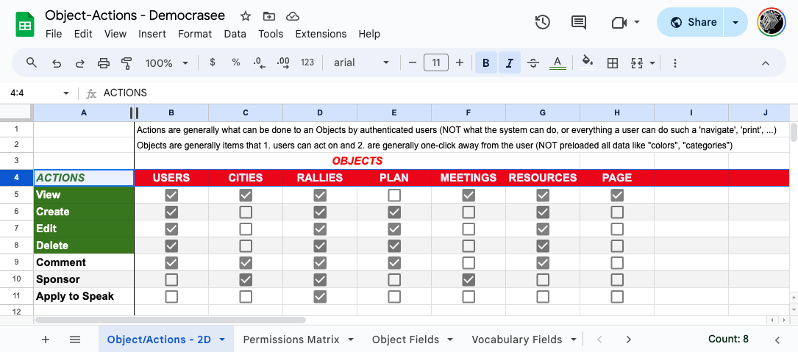
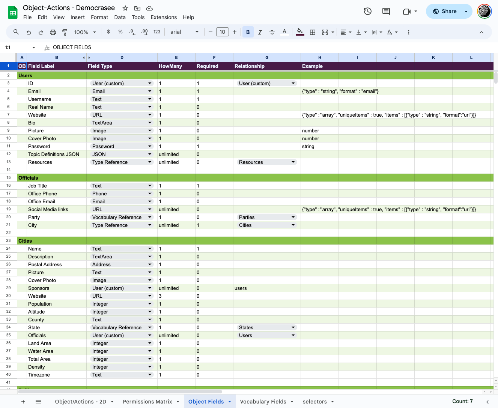
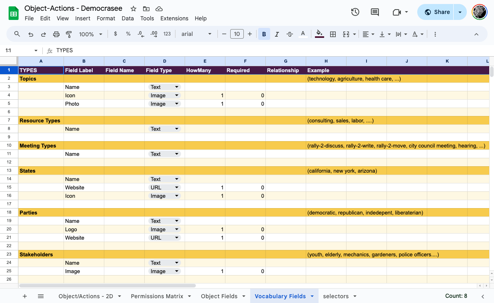
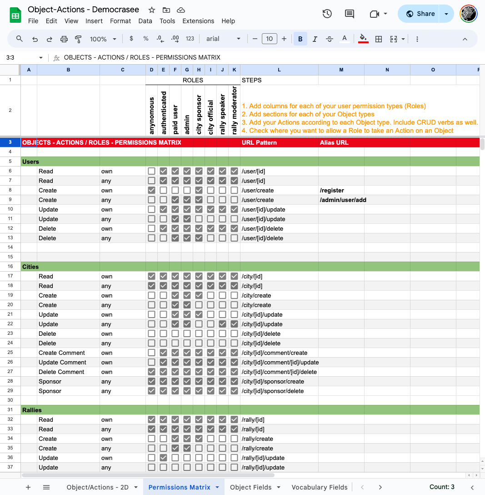
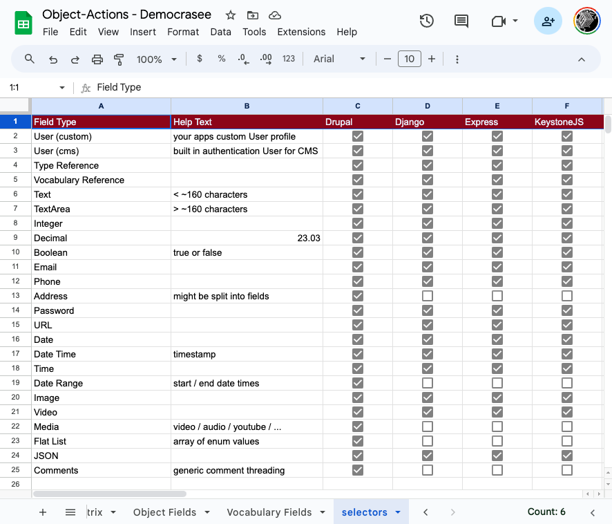

# Object-Actions Worksheet
----

## PURPOSE
- [x] Outlining application functionality and permissions
- [x] API documentation
- [x] SQL database schema design
- [x] Scaffolding Content Management Systems
- [x] Scaffolding API & CMS Authentication and Access Permissions
- [x] Scaffolding Web App interface and API connectivity
- [x] Scaffolding Cypress.io test suites
- [x] Generating unlimited numbers of fake data entries to test with

## USAGE:
- `git clone git@github.com:eliataylor/object-actions.git`
- `cd object-actions`
- `python3.9 -m venv .venv` (pretty much any version of python should work)
- `source .venv/bin/activate`
- `pip install -r requirements.txt`
- `python django/generate.py admin --types=examples/object-fields-nod.csv --output_dir=examples/generated`
The program uses the django-address package to provide the Address field type. That package is already included in the requirements.txt file. If you want to use the Address field type, you will need to add the 'address' entry to the INSTALLED_APPS list in your settings.py file:
```python
INSTALLED_APPS = [
    # ... 
    'address',
    # ... 
]
```

## Getting Started

Copy and start your own from this [empty version](https://docs.google.com/spreadsheets/d/14Ej7lu4g3i85BWJdHbi4JK2jM2xS5uDSgfzm3rIhx4o/edit?usp=sharing).

This [example version](https://docs.google.com/spreadsheets/d/1Jm15OeR6mS6vbJd7atHErOwBgq2SwKAagb4MH0D1aIw/edit?usp=sharing) describes an open source platform for rallying citizens to civic engagement called Democrasee (github.com/DemocraseeClub). Screenshots are below:







All Select options under Fields Types (Column D) in the Object Fields sheet come from column A in the "selectors" sheet. If you have special field types, add them here. The checkboxes roughly describe what Fields are support by the different CMS config builders in this repository.



## DEVELOPMENT ROADMAP
- [x] Generate Django Admin CMS
- [x] Generate Django Restfull API with Swagger Docs
- [ ] Generate Fake Data builder
- [ ] Generate ReactJS app
  - [ ] TypeScript interface and object types defined 
  - [ ] Material-UI Drawer of Permissions Matrix Paths
- [ ] Generate Cypress.io test suite