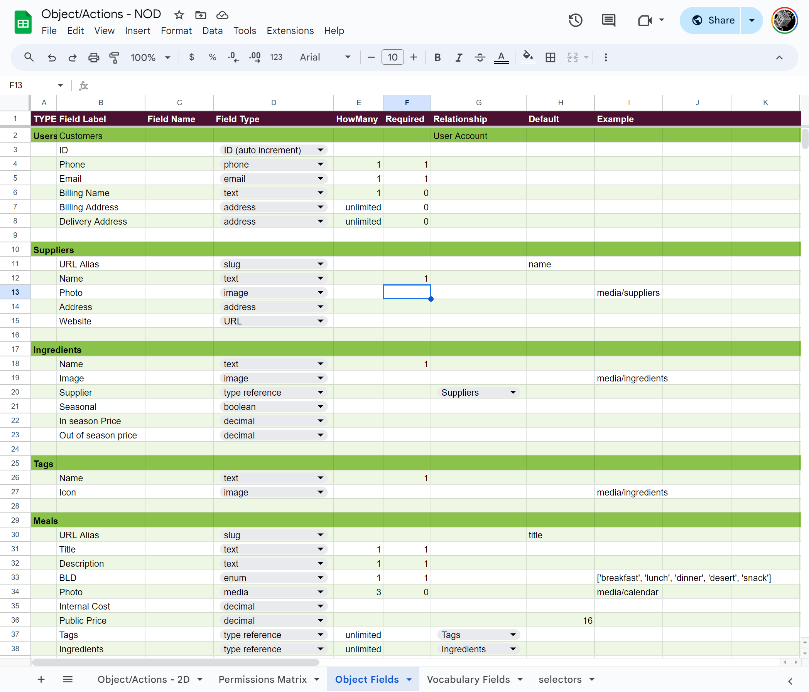

# Object-Actions Worksheet

--------------------------------------------------------------------------------

## PURPOSE

- [x] Learn Relational Database Schema Design
- [x] Quickly build idea App & API prototypes

- [x] Scaffold Content Management Systems
- [x] Scaffold Authentication and Access Permissions
- [x] Scaffold Web App interface and API connectivity
- [x] Scaffold Cypress.io test suites
- [x] Generate unlimited fake data to test and prototype

## USAGE:

### Generate your Django models, views, serializers and urls:

`python django/generate.py admin --types=examples/object-fields-nod.csv --output_dir=examples/django/oaexample_app`

### Generate your TypeScript types, interfaces and URL patterns:

`python django/generate.py typescript --types=examples/object-fields-nod.csv --output_dir=examples/reactjs/src/object-actions/types/types.tsx`

### Test API and Generate fake data for API

`cd databuilder && npm install && npm start`

### Run Frontend example from object-actions/examples/reactjs:

`cd object-actions/examples/reactjs && npm install && npm start`

### For step-by-step usage to build example projects see [USAGE.md](USAGE.md)

## Build your own project from Object/Actions spreadsheets

Copy and start your own from
this [Empty version](https://docs.google.com/spreadsheets/d/14Ej7lu4g3i85BWJdHbi4JK2jM2xS5uDSgfzm3rIhx4o/edit?usp=sharing).

This [Example version](https://docs.google.com/spreadsheets/d/1AkFY0dSelMAxoaLVA_knNHIYmL97rtVjE1zuqEonCyM/edit?usp=sharing)
describes a simple ecommerce project for a meal prep program:

|                 Objects to Actions                 |             Object Field Types              |                                                               Permissions Matrix                                                                |
|:--------------------------------------------------:|:-------------------------------------------:|:-----------------------------------------------------------------------------------------------------------------------------------------------:|
|  |   |  |

------------------------------------------ ↓ generates ↓ ------------------------------------------

  

     
    <caption>Demo Interface, and...</caption>
  

|                                                         Content Admin                                                          |                                                           API Documentation                                                           |                                                with Secure Authentication System                                                |
|:------------------------------------------------------------------------------------------------------------------------------:|:-------------------------------------------------------------------------------------------------------------------------------------:|:-------------------------------------------------------------------------------------------------------------------------------:|
|  |  |  |

To contribute: [CONTRIBUTING.md](CONTRIBUTING.md)