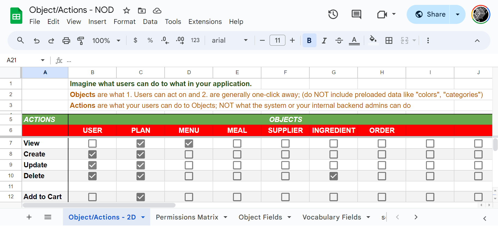
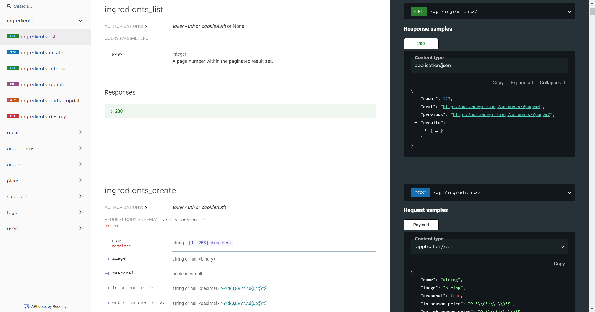

# Object-Actions Worksheet

## PURPOSE

- [x] Learn Relational Database Schema Design
- [x] Quickly build idea App & API prototypes

- [x] Scaffold Content Management Systems
- [x] Scaffold Authentication and Access Permissions
- [x] Scaffold Web App interface and API connectivity
- [x] Scaffold Cypress.io test suites
- [x] Generate unlimited fake data to test and prototype

## HOW
- [A] Defined your project's content Objects and the Actions to interact with them
- [B] Define the fields for each Object type
- [C] Define the roles and permissions for each Action per Object

|                 A: Objects to Actions                 |             B: Object Field Types              |                                                               C: Permissions Matrix                                                                |
|:--------------------------------------------------:|:-------------------------------------------:|:-----------------------------------------------------------------------------------------------------------------------------------------------:|
|  |   |  |
| ↓ | ↓ generates ↓ | ↓ |

A secure API and CMS written in Django, with a fully integrated and authenticating ReactJS front-end:

|                                                         Content Admin                                                          |                                                           API Documentation                                                           |                                                with Secure Authentication System                                                |
|:------------------------------------------------------------------------------------------------------------------------------:|:-------------------------------------------------------------------------------------------------------------------------------------:|:-------------------------------------------------------------------------------------------------------------------------------:|
|  |  |  |

## USAGE:

#### Generate your Django models, views, serializers and urls:
`python django/generate.py admin --types=examples/object-fields-nod.csv --output_dir=examples/django/oaexample_app`

#### Generate your TypeScript types, interfaces and URL patterns:
`python django/generate.py typescript --types=examples/object-fields-nod.csv --output_dir=examples/reactjs/src/object-actions/types/types.tsx`

#### Test API and Generate fake data for API
`cd databuilder && npm install && npm start`

#### Run Frontend example from object-actions/examples/reactjs:
`cd object-actions/examples/reactjs && npm install && npm start`

#### For step-by-step usage to build example projects see [USAGE.md](USAGE.md)

## Build your own project from Object/Actions spreadsheets

Copy and start your own from this [Empty version](https://docs.google.com/spreadsheets/d/14Ej7lu4g3i85BWJdHbi4JK2jM2xS5uDSgfzm3rIhx4o/edit?usp=sharing).

Or copy and edit this [Example version](https://docs.google.com/spreadsheets/d/1AkFY0dSelMAxoaLVA_knNHIYmL97rtVjE1zuqEonCyM/edit?usp=sharing) for a meal prep program:

--------------------------------------------------------------------------------

### To contribute: [CONTRIBUTING.md](CONTRIBUTING.md)
