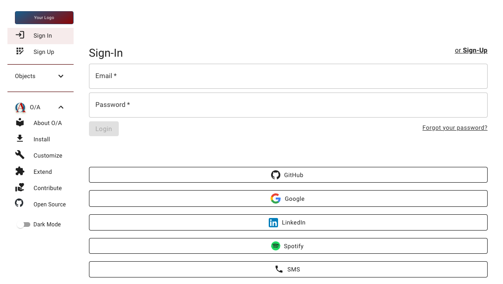

_Objects/Actions_

**Live Demo and Docs: [https://oaexample.com/readme](https://oaexample.com/readme)**
# From Spreadsheets to Full Stack

## WHY

- [x] Document your Idea and Database
- [x] Quickly scaffold scalable Apps & APIs. Including:
  - [x] Authentication with Email, SMS, and nearly every social network
  - [x] Access Controls for User Groups and content ownership context
  - [x] Web App interface with API connectivity
  - [x] Complete End-To-End tests for functionality and content permissions
  - [x] Data generator to create unlimited content data to test and prototype, and the base data for your Cypress tests 

## HOW

|                                                          1: Define your Fields for each Object Type                                                          |                                                                     2: Define your roles and permissions                                                                    |
|:----------------------------------------------------------------------------------------------------------------------------------------:|:-------------------------------------------------------------------------------------------------------------------------------------------------------------:|
|  |  |

> `docker-compose up --build`
>
> ↓ Generates this whole stack ↓

https://github.com/user-attachments/assets/1263c2d0-0ed3-45af-9d3c-0037ec4db77b

|                                                         Content Admin                                                          |                                                                      API Docs                                                                       |                                                                Front-End WebApp                                                                |
|:------------------------------------------------------------------------------------------------------------------------------:|:---------------------------------------------------------------------------------------------------------------------------------------------------:|:----------------------------------------------------------------------------------------------------------------------------------------------:|
|  |  |  |

#### Build a scalable, secure API and CMS in Django, a fully integrated and authenticating ReactJS web app, end-to-end tests with Cypress.io and API load tests with K6. Includes OAuth logins from Google, Facebook, Spotify, SMS, and pretty much social network that provides OAuth.

# TO RUN:

- `git clone git@github.com:eliataylor/object-actions.git`
- `cd object-actions`
- `docker-compose up --build`

Out-of-the-Box this will give you:

- [x] ReactJS Front-End: https://localhost.oaexample.com:3000
- [x] Django Admin: https://localapi.oaexample.com:8080/admin/login
- [x] Django API: https://localapi.oaexample.com:8080/api/schema/swagger
- [x] NodeJS Databuilder: Follow [README.md](stack/databuilder/README.md) to generate data
- [x] Cypress Test Suite: Follow [README.md](stack/cypress/README.md) to run end-to-end tests

As well, edits to all source are automatically reloaded. For example, try changing the theme colors in [ThemeContext.js](stack/reactjs/src/theme/ThemeContext.js)  

# TO CUSTOMIZE:
1. Copy and customize your own worksheets from this [Empty version](https://docs.google.com/spreadsheets/d/14Ej7lu4g3i85BWJdHbi4JK2jM2xS5uDSgfzm3rIhx4o/edit?usp=sharing) or this populated [Example version](https://docs.google.com/spreadsheets/d/1Jm15OeR6mS6vbJd7atHErOwBgq2SwKAagb4MH0D1aIw/edit?usp=sharing):
2. Download your Object Fields and set the `TYPES_PATH` in your [.env](.env) 
3. Download your Permissions Matrix and set the `PERMISSIONS_PATH` in your [.env](.env)
4. Run `./load-sheets.sh --env .env` (or reference your own .env.myproject)

- If you want to build from source follow [FROMSOURCE.md](docs/FROMSOURCE.md)
- If you already have a codebase and only want to generate TypeScript or Django code visit [COMMANDS.md](docs/COMMANDS.md) to generate individual files 

# TO EXTEND:
1. Update any settings you the [.env](.env) file 
2. `./clone.sh --env .env` this will clone the entire stack to STACK_PATH
3. `cd STACK_PATH`
4. `docker-compose up --build`

--------------------------------------------------------------------------------

### TO CONTRIBUTE: [CONTRIBUTING.md](docs/CONTRIBUTING.md)

### TO SPONSOR: [github.com/sponsors/eliataylor](https://github.com/sponsors/eliataylor)

---
Example Site: [https://oaexample.com/readme](https://oaexample.com/readme)

Offer Sign-in / Sign-up from any of these [AllAuth Providers](https://docs.allauth.org/en/dev/socialaccount/providers/index.html)

